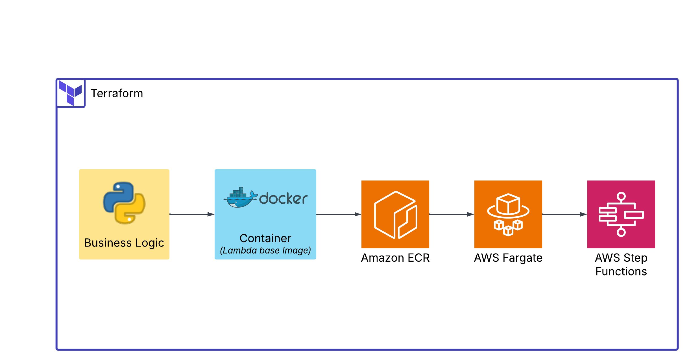

# aws-fargate-step-function-terraform
Small repo that creates an AWS Step Function to call Fargate tasks with Terraform.


This repo is related to two other repos. The first [repo](https://github.com/daniel-fudge/aws-fargate-step-function-demo) 
deployed the same Step Function but performed it with CLI commands. It also deployed the 
same ECR image to a Lambda Function called be a Step Function to demostrate the 
versatility of the ECR image.   
The second [repo](https://github.com/daniel-fudge/aws-fargate-step-function-cloud-formation) 
deployed the Fargate Step Function with CloudFormation.    
This repo replicates the CloudFormation repo in Terraform to compare the two IaC packages. 
It also skips the initial task stack and moved the ECR image creation to a sub-folder. 

## Setup the Environment
### Configure the AWS Console
Before completing the following CLI command, you need to install the AWS CLI and configure 
it for the account, role and region you wish to use. I use the `aws configure sso` command.

### First set some environment variables
```shell
export AWS_ACCOUNT_ID=[ENTER YOUR AWS ACCOUNT ID HERE]
export AWS_PROFILE=[ENTER YOUR CLI PROFILE NAME HERE]
export BUCKET=[ENTER YOUR BUCKET NAME HERE]
export AWS_PAGER=""
export AWS_REGION=us-east-1
export IMAGE_NAME=timer
export IMAGE_TAG=v1
```

### S3 and ECR Image Creation
This is the exact same setup as required in the previous two repos. If you already have 
the S3 bucket and ECR image created there you can skip to the next section. If you don't, 
you can follow the make-ecr-image [README](make-ecr-image/README.md). 

## Install Terraform CLI
Install the Terrafform CLI with [these](https://developer.hashicorp.com/terraform/tutorials/aws-get-started/install-cli) 
instructions.

## Create the Terraform Stack
### Initialize the terraform project. 
After running the following command you should see `Terraform has been successfully initialized!`
```shell
terraform init
```

### Create the Stack 
Enter the following command, review the actions and then type `yes` to proceed. After 
pressing `return` you should see `Apply complete!`
```shell
terraform apply
```

### Invoke the step function
The ouput of the deployed stack includes the command to run the Step Function from the 
CLI. The command begins with `aws stepfunctions start-execution`. You can get this from 
the AWS console or you can run the command below.

```shell

```

### Delete the Stack
Enter the following command, review the actions and then type `yes` to proceed. After 
pressing `return` you should see `Destroy complete!`
```shell
terraform destroy
```

## References
 - [CLI Repo Version](https://github.com/daniel-fudge/aws-fargate-step-function-demo)    
 - [CloudFormation Example Repo](https://github.com/nathanpeck/aws-cloudformation-fargate)    
 - [Terraform CLI Install](https://developer.hashicorp.com/terraform/tutorials/aws-get-started/install-cli)    
